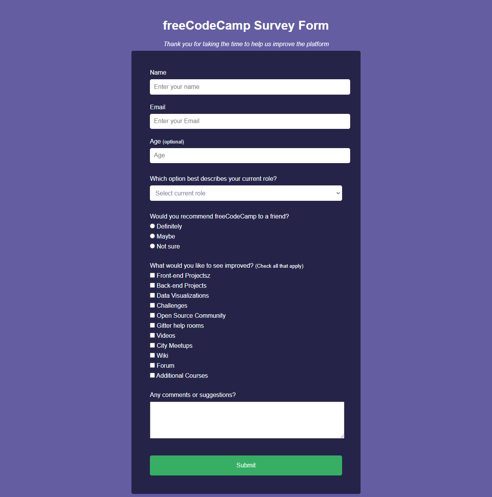

# Proyecto 1 para Certificación RESPONSIVE WEB DESIGN - FreeCodeCamp

## Formulario de Encuesta
Construir un formulario de encuesta para recolectar los datos de los usuarios.

## Requerimientos:
1. Debe tener un título de página en un elemento h1 con una identificación de título
2. Debe tener una breve explicación en un elemento p con una identificación de descripción
3. Debe tener un elemento de formulario con una identificación de formulario de encuesta
4. Dentro del elemento de formulario, debe ingresar su nombre en un campo de entrada que tiene una identificación de nombre y un tipo de texto
5. Dentro del elemento de formulario, debe ingresar su correo electrónico en un campo de entrada que tiene una identificación de correo electrónico
6.Si ingresa un correo electrónico que no tiene el formato correcto, verá un error de validación de HTML5
7. Dentro del formulario, puede ingresar un número en un campo de entrada que tiene una identificación de número
8. La entrada de números no debe aceptar números que no sean números, ya sea impidiendo que los escriba o mostrando un error de validación de HTML5 (dependiendo de su navegador).
9. Si ingresa números fuera del rango de la entrada de números, que están definidos por los atributos mínimo y máximo, verá un error de validación de HTML5
10. Para los campos de entrada de nombre, correo electrónico y número, puede ver los elementos de etiqueta correspondientes en el formulario, que describen el propósito de cada campo con las siguientes identificaciones: id="name-label", id="email-label" y id="número-etiqueta"
11. Para los campos de entrada de nombre, correo electrónico y número, puede ver un texto de marcador de posición que brinda una descripción o instrucciones para cada campo
12. Dentro del elemento de formulario, debe tener un elemento desplegable de selección con una identificación de menú desplegable y al menos dos opciones para elegir
13. Dentro del elemento de formulario, puede seleccionar una opción de un grupo de al menos dos botones de radio que se agrupan usando el atributo de nombre
14. Dentro del elemento de formulario, puede seleccionar varios campos de una serie de casillas de verificación, cada una de las cuales debe tener un atributo de valor
15. Dentro del elemento de formulario, se le presenta un área de texto para comentarios adicionales
16. Dentro del elemento de formulario, se le presenta un botón con id de envío para enviar todas las entradas

## Tecnologías Utilizadas:
* HTML5
* CSS3

## Acerca del autor:
* [LinkedIn](https://www.linkedin.com/in/carlos-munera-259969262 "Linkedin")
* [freeCodeCamp](https://www.freecodecamp.org/fcc0dc40656-86b6-4bd7-a2b0-5ccd1ae5cc31 "FreeCodeCamp")